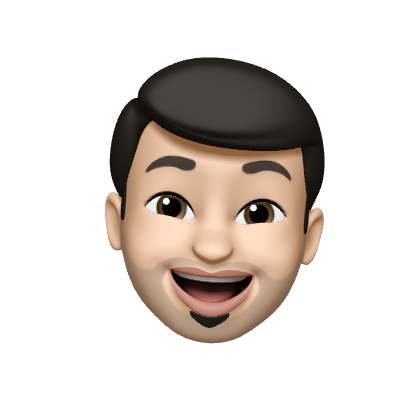

  

<h2>Hi there 👋</h2>

I am currently pursuing a Master's in `Software Engineering` at `Cleveland State University` and bring with me `four years of experience` as a software engineer. Passionate about technology and innovation, I am keen on contributing to and evolving with a forward-thinking team.

**_I'm actively seeking full-time opportunities in SDE/ML Engineer roles starting May 2024. Your reference is valuable to me!_**

